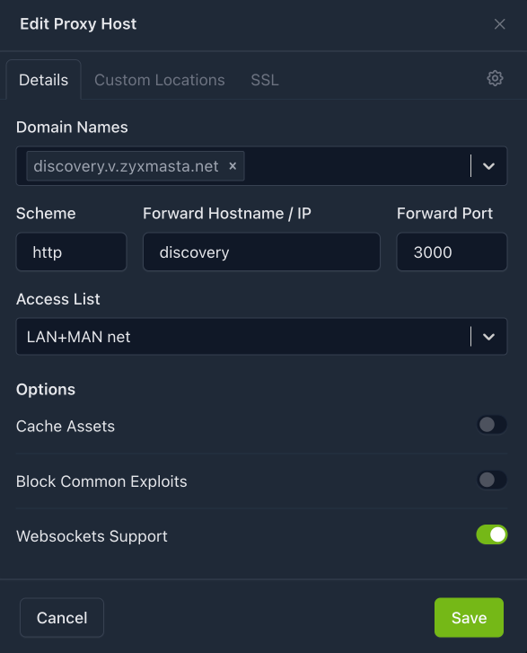
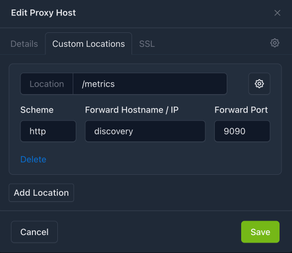
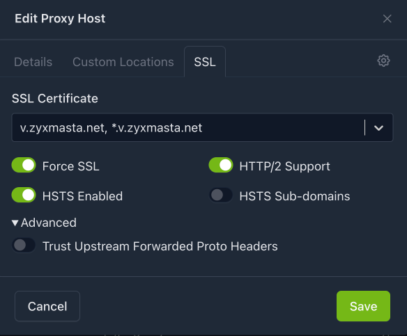
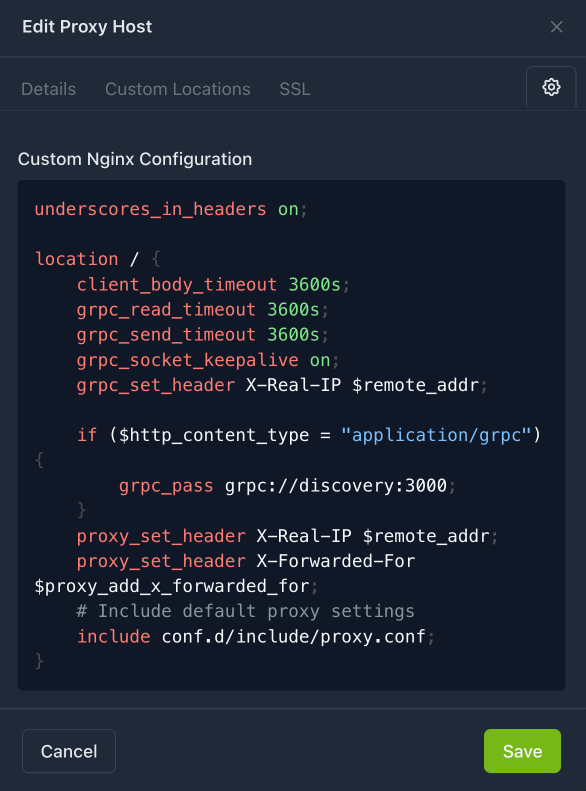

# Local Discovery Service

## Prepequisites

- Docker Installed;
- Nginx Proxy Manager running on Docker;
- Nginx Proxy Manager network is `proxy-net`;
- Discovery service hostname `discovery.v.zyxmasta.net` poiting on Nginx Proxy Manager;

## Running Service

Create `compose.yml` file with contents:

```yaml
services:
  discovery:
    image: ghcr.io/siderolabs/discovery-service:v1.0.17
    container_name: discovery
    hostname: discovery
    command:
      - --addr=:3000
      - --metrics-addr=:9090
    # optional
    # environment:
    #   - MODE=dev
    # optional: persist state snapshots
    volumes:
      - ./discovery:/var/discovery-service
    networks:
      - proxy-net
    restart: unless-stopped

networks:
  proxy-net:
    external: true
```

Up service with:

```
docker compose up -d
```

## Base Proxy Host Settings

On Details tab add basic proxy configuration:



On Custom Locations tab add location to service metrics:



On SSL tab select appropriate SSL certificate for discovery service's domain:



## Custom nginx configuration

Click on cog tab to add custom nginx configuration and enter next snippet:

```nginx
underscores_in_headers on;

location / {
    client_body_timeout 3600s;
    grpc_read_timeout 3600s;
    grpc_send_timeout 3600s;
    grpc_socket_keepalive on;
    grpc_set_header X-Real-IP $remote_addr;

    if ($http_content_type = "application/grpc") {
        grpc_pass grpc://discovery:3000;
    }
    proxy_set_header X-Real-IP $remote_addr;
    proxy_set_header X-Forwarded-For $proxy_add_x_forwarded_for;
    # Include default proxy settings
    include conf.d/include/proxy.conf;
}
```

Custom configuration:



## Testing service functionality

To test install [grpcurl](https://github.com/fullstorydev/grpcurl) and clone [Talos Discovery Service API](https://github.com/siderolabs/discovery-api).

Test command

```bash
grpcurl -vv -proto v1alpha1/server/cluster.proto \
    -import-path ./discovery-api/api \
    -d '{"clusterId": "abc"}' \
    discovery.v.zyxmasta.net:443 \
    sidero.discovery.server.Cluster/Hello
```

Service response would be (if everything works fine)

```
Resolved method descriptor:
// Hello is the first request sent by the client.
//
// Server might redirect the client to a different instance.
rpc Hello ( .sidero.discovery.server.HelloRequest ) returns ( .sidero.discovery.server.HelloResponse );

Request metadata to send:
(empty)

Response headers received:
content-type: application/grpc
date: Sat, 16 May 2026 03:49:51 GMT
server: openresty
trailer: Grpc-Status
trailer: Grpc-Message
trailer: Grpc-Status-Details-Bin
x-served-by: discovery.v.zyxmasta.net

Estimated response size: 6 bytes

Response contents:
{
  "clientIp": "Cv9GNw=="
}

Response trailers received:
(empty)
Sent 1 request and received 1 response
Timing Data: 326.41675ms
  Dial: 321.84025ms
    TLS Setup: 3.083µs
    BlockingDial: 321.826959ms
  InvokeRPC: 3.729792ms
```

On the service side (`docker logs --tail=20 -f discovery`):

```
2026-05-16T03:49:51.560Z	INFO	server/logging.go:58	/sidero.discovery.server.Cluster/Hello	{"duration": "27.884µs", "code": "OK", "peer.address": "10.255.70.55", "cluster_id": "abc", "client_version": ""}
```

## Nodes' configuration

Patch for using local discovery service:

```yaml
---
# Local discovery service
# cluster/patches/local-discovery.yaml
cluster:
  discovery:
    enabled: true
    registries:
      service:
        disabled: false
        endpoint: https://discovery.v.zyxmasta.net/
      kubernetes:
        disabled: true
```

Apply patch to the nodes:

```bash
talosctl -n node1,node2,node3 patch mc --patch cluster/patches/local-discovery.yaml
```

Checking if nodes accept new discovery service:

```
talosctl -n node1,node2,node3 get discoveryconfig cluster -o json | jq '.spec.serviceEndpoint'
```

Get the cluster ID:

```
talosctl -n node1 get info current -o json | jq '.spec.clusterId'
```

Ensure that discovery service serving cluster:

```
grpcurl -vv -proto v1alpha1/server/cluster.proto \
    -import-path ./discovery-api/api \
    -d '{"clusterId": "$clusterId"}' \
    discovery.v.zyxmasta.net:443 \
    sidero.discovery.server.Cluster/List
```

where `$clusterId` - actual cluster identifier.
